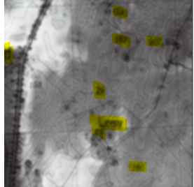
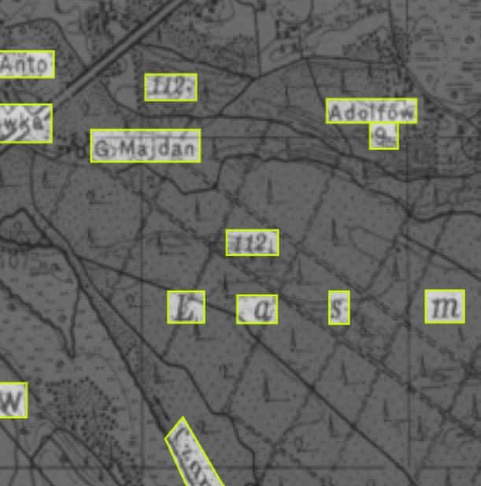
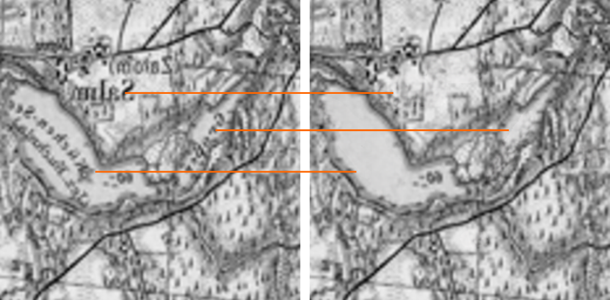

# Data Cleaning

Training a GANS requires very high-quality data. After attempts to train the model using uncleaned input data it became obvious rather soon that more effort had to be put into provding as high-quality (era-specific) input images (maps) as possible.

Apply a two-step process to remove all non geographic objects including:

* text
* numbers
* symbols (church, etc.)
* geometric shapes used as notation (triangles)

## Step 1

annotation performed using online service: [http://app.roboflow.com]()

For a given MAP input image identify all non-geographical objects 

## Step 2

example manually created using online inpainting service: [https://cleanup.pictures/](https://cleanup.pictures/)

Apply an in-painting algorithm to replace the identified objects with probable background (that which is occluded)
