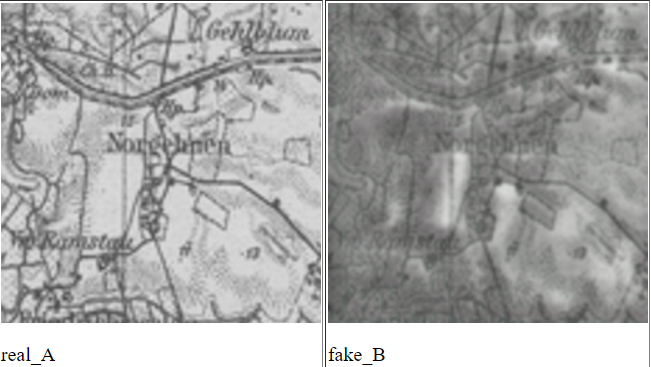

# HistoricEarth

Imagine flying over any part of Poland as it appeared in 1939. Which town would you visit? Would you recognize a family home or a relatives school yard? My goal with this project is to bring maps to life by making them accesisble like never before by rendering them as aerial photos, just like in Google Earth.

## Inspiration

There is a large database of aerial photography from this period covering Poland held by the British government. Unfortunatly they have very restrictive licenses and charge $20+ per single image. I don't like how they took the Germans WW2 archives and locked them up behind a pay-wall. Such amazing and informative data (historical aerial photos) should be available to anyone, amateur or professional alike. This is my attempt to make use of that.

Note: No images from the British WW2 Aerial photo archives were used to train this model

## Epoch Samples

## Epoch 66 + 11 (128x128)

### Epoch 122 (128x128)

### Epoch 116 (128x128)

### Epoch 72 (128x128)

### Epoch 27

### Epoch 22

## Library used for training
[Contrastive Unpaired Translation](https://github.com/taesungp/contrastive-unpaired-translation)

## Training

Currently making use of an $8/month Paperspace Gradient Pro plan which is a bit more reliable than Google Colab (free) which I had used on my previous attempts. Due to frustration with constant crashes and other issues that made it a pain, I decided to try out Gradient.

So far I've managed to train 86 epochs. My goal is to train at least 200 epochs and see what it looks like.

Total training time thus far is approx: 10 hours

## Future Plans

1. Collecting enough early 20th century maps of the entire globe to make simulate the entire Earth as it would've looked from an airplane in 1939.
2. Building an aerial photo search engine/geolocation tool

### Links discovered while working on this project

[Make use of colab features outside of colab](https://github.com/TakahiroDoi/opencv-workaround-for-colab/blob/main/Example_Cv2Workaround.ipynb)
[List of Related projects](https://www.thoughtco.com/historical-map-overlays-for-google-1422162)
